<div align="center">

<!-- Neural Network Animation -->


<!-- Avatar -->


<!-- Capsule Banner -->
<p>

</p>

<!-- Dynamic Typing Animation -->
<p>
  <a href="https://github.com/Timwood0x10">
    
  </a>
</p>

<!-- Badges -->
<p>
  
  
</p>

</div>

---

## 🧠 About Me

```rust
struct Developer {
    name: &'static str,
    identity: &'static str,
    focus: Vec<&'static str>,
    languages: Vec<&'static str>,
    philosophy: &'static str,
}

impl Developer {
    fn new() -> Self {
        Developer {
            name: "TimWood 0x10",
            identity: "Timwood0x10",
            focus: vec![
                "Memory Safety & Runtime Visualization",
                "Static Analysis & Compiler Tooling (LLVM)",
                "Neural Network Interpretability & Profiling",
                "High-Performance Agent Frameworks",
            ],
            languages: vec!["Rust", "Go", "Zig", "Python"],
            philosophy: "在系统编程与人工智能的交汇处，探索代码的深层逻辑。
                         不满足于「能用」，追求「看透」。",
        }
    }
}
```

Former Web3 engineer. Currently building **tools that understand memory** — because Valgrind doesn't know what `Arc<Rc<Box<...>>>` means, and someone has to fix that.

<p align="center">
  
</p>

---

## 🏗️ Systems & Infrastructure

<table>
<tr>
<td width="50%" valign="top">

### 🔬 [memscope-rs](https://github.com/just-for-dream-0x10/memscope-rs)

**Rust runtime memory analysis tool**

Variable-level memory tracking that Valgrind and AddressSanitizer can't do.

- 🎯 7 detectors (leak, UAF, double-free, data race...)
- 📊 HTML interactive dashboard
- 🧵 Async task-level memory attribution
- 🔗 Arc/Rc clone detection & cycle detection
- ⚡ <5% tracking overhead, 4-thread super-linear scaling
- 📏 112K lines, 2,483 tests, 0 production panic

`Rust` `GlobalAlloc` `UTI-Engine` `Ownership-Graph`

</td>
<td width="50%" valign="top">

### 🔭 [OmniScope](https://github.com/just-for-dream-0x10/OmniScope)

**LLVM IR static safety analysis in Zig**

Static unsafe/FFI boundary analysis at the LLVM IR level.

- 🔍 Unsafe block boundary detection
- 🔗 FFI call chain tracing
- 🛡️ Safety-first analysis philosophy

`Zig` `LLVM-IR` `FFI` `Static-Analysis`

</td>
</tr>
<tr>
<td width="50%" valign="top">

### ⚡ [go-scheduler](https://github.com/TimWood0x10/go-scheduler)

**Minimal GPU scheduler for AI workloads**

Simple. Deterministic. Reliable.

- 🎯 Designed for inference workloads
- 📐 Deterministic scheduling
- 🚀 Minimal overhead

`Go` `GPU` `Scheduler` `AI`

</td>
<td width="50%" valign="top">

### 🌐 [ethermint](https://github.com/TimWood0x10/ethermint)

**EVM-compatible blockchain in Go**

Fork from Evmos, ported Tendermint to sei-tendermint.

- ⛓️ EVM compatibility layer
- 🔧 Tendermint consensus adaptation
- 📦 Full blockchain node

`Go` `EVM` `Tendermint` `Blockchain`

</td>
</tr>
</table>

---

## 🤖 AI & LLM

<table>
<tr>
<td width="50%" valign="top">

### 🤖 [go-agent](https://github.com/just-for-dream-0x10/go-agent)

**Multi-agent framework in Go**

Custom agent framework with memory distillation and vector search.

- 🧠 Multi-agent orchestration
- 📝 Memory distillation with PGVector
- 🔍 Embedding-based retrieval
- 🔄 Multi-round reasoning loops

`Go` `AI-Agents` `PGVector` `Embedding`

</td>
<td width="50%" valign="top">

### 🎨 [StyleAgent](https://github.com/TimWood0x10/StyleAgent)

**AI-powered outfit recommendation system**

- 🧠 AI-based style analysis
- 👕 Outfit recommendation engine
- 📸 Image understanding pipeline

`Python` `AI` `Recommendation` `Computer-Vision`

</td>
</tr>
<tr>
<td width="50%" valign="top">

### 📈 [predict](https://github.com/TimWood0x10/predict)

**Crypto currency Decision Engine**

- 📊 Market data analysis
- 🤖 ML-based prediction pipeline
- 💹 Trading signal generation

`Python` `ML` `Crypto` `Finance`

</td>
<td width="50%" valign="top">

</td>
</tr>
</table>

---

## 📚 Teaching & Visualization

<table>
<tr>
<td width="50%" valign="top">

### 📐 [Basic_math](https://github.com/just-for-dream-0x10/Basic_math)

**Interactive ML math visualization system**

32 interactive modules, 150+ Manim animations, 8 learning paths.

- 🎯 32 modules: linear algebra, optimization, DL, frontier
- 🎬 150+ Manim animation scenes
- 📊 Real-time parameter tuning & observation
- 🗺️ 133 concepts, 20-layer dependency graph
- 📐 Transformer parameter/FLOPs/memory calculators

`Python` `Streamlit` `Manim` `Math-Education`

</td>
<td width="50%" valign="top">

### 🏗️ [Transformer_explorer](https://github.com/just-for-dream-0x10/Transformer_explorer)

**Transformer & Mamba architecture visualization**

Math-driven deep learning architecture explainer with animations.

- 🎬 Manim animations: Encoder, Decoder, Cross Attention, RoPE
- 🐍 Mamba SSM: selective mechanism, discretization
- 🔬 Interactive: attention computation, softmax temperature
- 📊 Training: AdamW, BPE, mixed precision, loss analysis
- ⚡ Transformer vs Mamba complexity comparison

`Python` `Manim` `Streamlit` `Transformer`

</td>
</tr>
<tr>
<td width="50%" valign="top">

### 🔬 [Model_explorer](https://github.com/just-for-dream-0x10/Model_explorer)

**Neural network computation anatomy lab**

Layer-by-layer parameter, FLOPs and numerical computation analysis.

- 🔢 8 layer types: Conv2d, Linear, MHA, LSTM, Embedding...
- 📊 7 networks: ResNet, VGG, BERT, GPT-2, ViT...
- ⚡ Parameter/FLOPs/memory analysis with optimization tips
- 🏛️ Failure case museum: gradient vanishing, parameter explosion
- 🧬 Single neuron analysis: Sigmoid, Tanh, ReLU, LSTM, GRU

`Python` `Streamlit` `PyTorch` `Visualization`

</td>
<td width="50%" valign="top">

### 📖 [beginML](https://github.com/Timwood0x10/beginML)

**ML notes & tutorials**

Beginner-friendly machine learning learning materials.

- 📝 Comprehensive ML notes
- 🎯 From zero to practice
- 🌐 Interactive HTML format

`HTML` `Machine-Learning` `Education`

</td>
</tr>
</table>

---

## 📊 Stats

<div align="center">


</div>

---

## 🐍 Contribution Graph

<p align="center">
  <a href="https://github.com/Timwood0x10">
    
  </a>
</p>

---

## 🛠️ Tech Stack

<div align="center">

| Systems | AI & Data | Teaching |
|---------|-----------|----------|
|  |  |  |
|  |  |  |
|  |  |  |

</div>

---

## 💡 Philosophy

```bash
$ philosophy --query "what drives you"
> "在 0x10 的世界里，每一行代码都是一次探索。
>  从 Rust 的内存安全到 Zig 的底层控制，
>  从 Transformer 的注意力到 LLVM 的指令流，
>  我相信：理解底层，才能构建未来。
>  不满足于「能用」，追求「看透」。"
```

> **大胆假设，小心实现，敢于质疑。**
